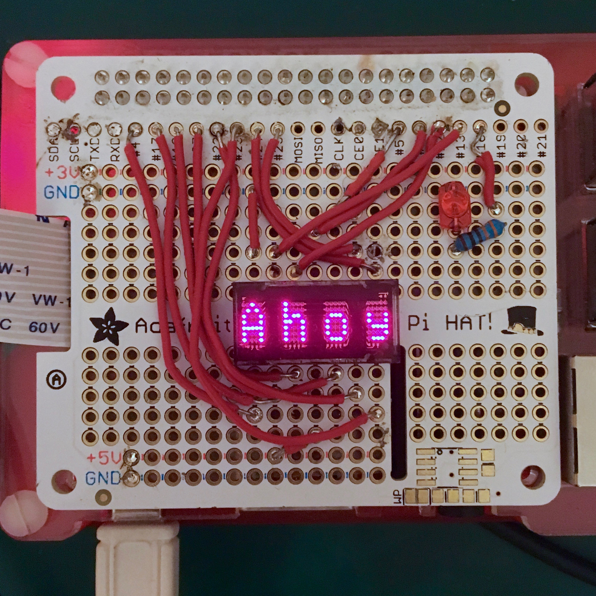

#RPi-SLX2016
A dirty piece of code that drives SLX2016 modules on a RPi.



##Default pin settings
~~Breadboard every single time accordingly:~~

Solder every thing up!

SLX2016 | GPIO.BCM
--- | ---
WR | 4
A0 | 17
A1 | 18
D0 | 27
D1 | 22
D2 | 23
D3 | 24
D4 | 25
D5 | 5
D6 | 6
BL | 12
CLR | 13

You can always override these settings:
```python
import SLX2016
display = SLX2016.SLX2016(WR,A0,A1,D0,D1,D2,D3,D4,D5,D6,BL,CLR)
```

##Get it running
```python
from SLX2016 import SLX2016
display = SLX2016()
display.set_string("Hey!")
```

##Usage of ``set_character_ascii``
bin, dec & hex. They are all okay. 
```python
display.set_character_ascii(0, 0b1111111)
display.set_character_ascii(0, 127)
display.set_character_ascii(0, 0x7f)
```
Those lines do the same thing.
Looking for some special symbols? The data sheet might come in handy.

##Clean up the party
```python
from SLX2016 import SLX2016
display = SLX2016()
display.clear()
```
`try:` and `except KeyboardInterrupt:` might come in handy.
